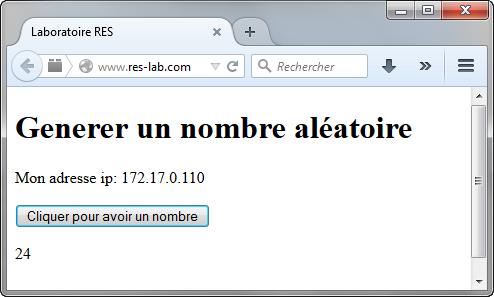

# RES: Web Infrastructure Lab (Documentation)

## Matériel utilisé

Pour faire notre infrastructure, nous avons utlisé un docker (http) contenant déjà apache avec un fichier de configuration bien rempli pour le reverse proxy et le load balancer. Pour le frontend, nous en utilisons un avec PHP, nous permettent ainsi d'avoir une page en PHP. Le backend est fait en node.js.

Pour le partage d'informations et de fichier nous avons utilié Slack

## Mise en place

La première étape pour pouvoir tester notre infrastructure, et d'ajouter la ligne suivante dans le fichiers **hosts** de votre machine afin de pouvoir visualiser le résultat dans votre navigateur web:

	192.168.42.42 www.res-lab.com 
    #l'adresse IP correspond à celle de l'environnement vagrant

Ensuite, il faut faire un **vagrant up** puis **vagrant ssh** pour pouvoir entrer dans l'environnement vagrant. 
Pour pouvoir lancer tous les containers, il y a des scripts bash qui lancent toute l'infrastructure. 

Le premier à lancer est **build\_images** construisant les différents containers. Puis **run_loadbalancer** pour lancer le loadbalancer.  Ensuite, on execute **run\_containers** pour les lancés (Note: ils sont lancé en arrière plan). Il y a **stop-All_containers** qui permet d'arrêter tout les containers lancé avec le script précédent.

Actuellement, il y a une découverte dynamique.

Le script lance 1 container pour le proxy / balancer, 2 pour le frontend et 2 pour le backend.

## Test du bon fonctionnement

Pour pouvoir observer si tout marche comme il faut, ouvrez une page internet avec votre 
navigateur à l'adresse **www.res-lab.com** et vous devriez observer ceci:

Si vous appuyer sur le bouton, un nombre aléatoire devrais apparaitre à chaque nouvelle appuye.

Auteurs: 

- Joao Miguel Domingues Pedrosa
- Toni Dias
- Nicolas Kobel
- Marc Pellet
- Bryan Perroud
