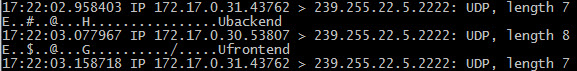
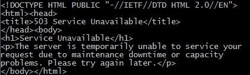
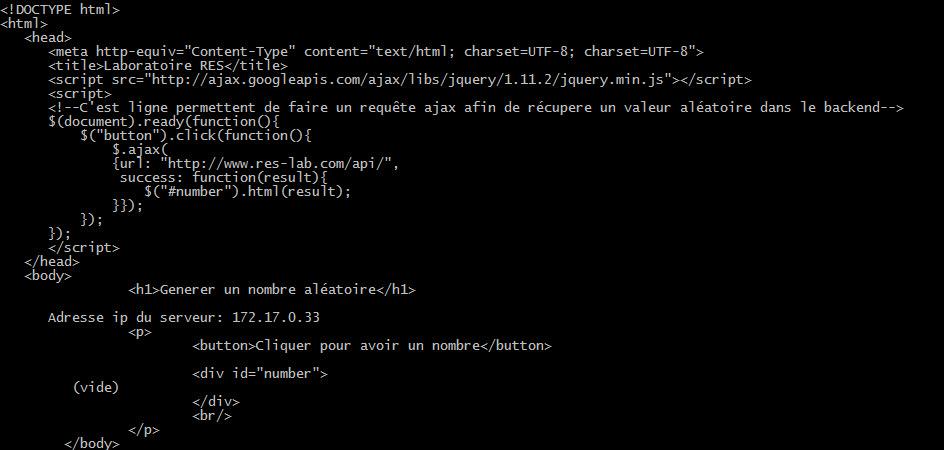
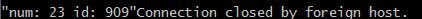
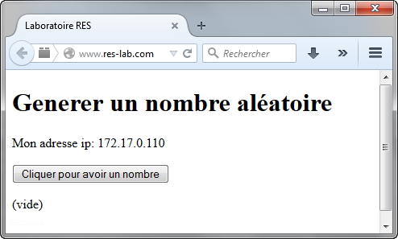
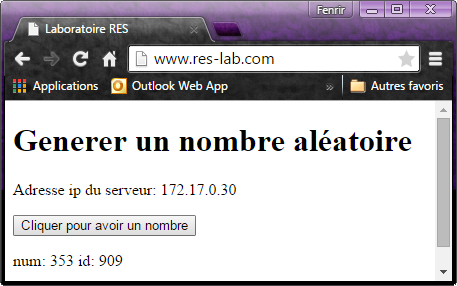
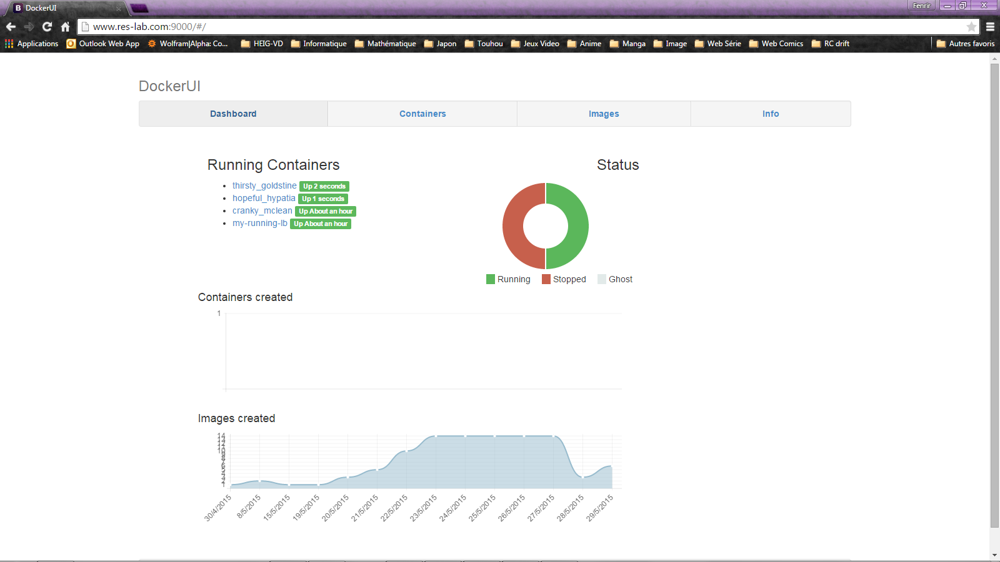

# RES: Web Infrastructure Lab (Documentation)

## Description de l'application
L'application permet simplement d'afficher l'adresse IP du serveur et de genérer un nombre aléatoire avec un ID pour savoir quel serveur à envoier le nombre. Le but est de  

## Description de l'infrastructure
### frontend
Le frontend est un serveur HTTP implémentent PHP. Nous avons choisi d'implémenté un fichier index.php contenant du html et une requête ajax pour le rafraichissment dynamique du numéro aléatoire.
### backend
Le backend est un serveur qui écoute sur le port 80 et envoie un nombre aléatoire et un id fixe en JSON lorsqu'un requête lui est envoier.
### proxy / loadbalancer
Le proxy retranscrit le chemin demandé sur l'adresse ip et le port voulu.
Le loadbalancer permet le dispachement des requêtes sur plusieurs serveurs (qui à l'origine font la même chose). Cela permet d'éviter une surcharge des serveurs. Les frontends sont géré avec des stickysession qui permet de rediriger sur le même serveur lorsque la même personne refaît une requête au serveur load balancer.
### decouverte dynamique
Permet de gerer automatiquement les serveurs disponibles (backend / frontend) le tout est gerer par des heartbeat (messages envoyé à une certaine cadence) placé dans les backend et les frontend. Il se charge de voir quand un serveur disparaît ou apparaît. Dans le serveur proxy/loadbalancer se trouve la partie qui s'occupe de récupérer les datagrammes pour refaire la configuration du serveur et le relancer.

## Matériel utilisé

Pour faire notre infrastructure, nous avons utlisé un docker (http) contenant déjà apache avec un fichier de configuration bien rempli pour le reverse proxy et le load balancer. Pour le frontend, nous en utilisons un avec PHP, nous permettent ainsi d'avoir une page en PHP. Le backend, heartbeat et la découverte dynamique est fait en node.js. Pour pouvoire monitorer plusieurs node, nous avons utilisé pm2.

## Mise en place de l'infrastructure

La première étape pour pouvoir tester notre infrastructure, et d'ajouter la ligne suivante dans le fichiers **hosts** de votre machine afin de pouvoir visualiser le résultat dans votre navigateur web:

	192.168.42.42 www.res-lab.com  #l'adresse IP correspond à celle de l'environnement vagrant

Ensuite, il faut faire un **vagrant up** puis **vagrant ssh** pour entrer dans l'environnement vagrant. 
Pour lancer les containers, il y a des scripts bash qui construisant toute l'infrastructure. 

Le premier à executer est **build\_images.sh** construisant les différents images. Ensuite, on execute **run\_loadbalancer.sh** pour lancer le serveur proxy (nom du container: my-running-lb). Pour lancer un frontend, il faut faire la commande suivante:
	
	docker run -it -d --name <nom> my-front
Et pour lancer un backend:
	
	docker run -it -d --name <nom> my-back	
Il y a **stop\_all_containers.sh** qui permet d'arrêter tout les containers lancé précédement.
Les hearthbeats et la découverte dynamique se lance automatiquement des qu'un container est mis en marche.

> si les scripts ne s'éxecutent pas, faire un chmod +x <script\>

## Test du bon fonctionnement

Pour pouvoir observer si tout marche comme il faut, veuillez suivre cette marche à suivre:

> Toute la démarche a été fait sur la machine vagrant, sauf pour la partie visualisation sur navigateur

Pour vérifier si un des serveur est bien en fonctionnel (proxy / balancer, frontend ou backend), il faut faire un telnet sur le port 80 à l'adresse du container:

> Attention: utiliser localhost pour le serveur proxy / balancer car le port est rediriger sur la machine vagrant

	telnet <adresse ip> 80

Normalement, on vous demande de faire une requête HTTP, taper ceci:
	
	GET / HTTP/1.0 CRLF
	CRLF
Après ceci, vous devriez recevoir quelque chose

- frontend : la page en php
- backend : une valeurs aléatoire et un id en JSON
- proxy / load balancer : la page en php d'un des frontend sinon un status 503 car il ne trouve pas d'adresse auquel vous rediriger

Pour voir si les hearthbeats sont fonctionnel pour le frontend et le backend, faite un tcpdump:

> Il faut d'abord lancer au moins 1 frontend et backend

	sudo tcpdump -i docker0 udp -A
Normalement, vous devriez voir ceci:

On peut voir des messages comme backend et frontend, ceci indique que les bons messages sont envoyé. L'adresse multicast doit bien correspondre à 239.255.22.5 et sur le port 2222 sinon, il y a un problème. 

Maintenant, pour tester le découverte dynamique, veuillez d'abord arrêter tout les frontends, si il y en a.
Si vous faite une telnet sur le serveur load balancer et envoyez la même requête qu'avant, normalement vous aurez un status 503, car il ne connaît pas encore de frontend.

Maintenant, lancez un frontend et testez avec:
	
	GET / HTTP/1.0 CRLF
	CRLF

Normalement, une page html vous est renvoyer maintenant.

Ensuite, lancez un backend et testez avec:

	GET /api/ HTTP/1.0 CRLF
	CRLF

Un nombre aléatoire et un ID est vous est envoyer en JSON. 

Refaite plusieurs fois la requête pour tester que l'ID ne change pas.

Pour tester plus éfficacement, lancer plusieurs frontend et backend et refaîte les requête si-dessus.

Résutlat:

- Pour le frontend, l'adresse IP devrait changer à chaque fois.
- Pour le backend, l'ID envoyer devrait changer à chaque fois.

Maintenant, nous allons visualiser tout ça sur votre navigateur. Pour cela, ouvrez une page internet, tapez l'URL [http://www.res-lab.com](http://www.res-lab.com) (ou [http://192.168.42.42:80](http://http://192.168.42.42:80)) est vous devriez voir ceci:

Si vous appuyer sur le bouton, un nombre aléatoire devrais apparaitre à chaque nouvelle appuye ,une ID différente si plusieurs backend son lancé et une adresse IP différente par moment (du au stickysession) si plusieurs frontend sont lancés.

Pour manipuler des containers de manière visuel, on a utilisé dockerui.
Pour le lancer, faite la commande suivante:

	docker run -d -p 9000:9000 --privileged -v /var/run/docker.sock:/var/run/docker.sock dockerui/dockerui
Et pour pouvoir l'utiliser, taper ceci dans votre navigateur:

	http://192.168.42.42:9000

Grâce, à cette application, on peut visualiser quel container sont actif, les arrêters de manière graphique. Ce qui peut être agréable par moment et moins rustiques que de passer par la ligne de commande.

##Auteurs: 

- Joao Miguel Domingues Pedrosa
- Toni Dias
- Nicolas Kobel
- Marc Pellet
- Bryan Perroud