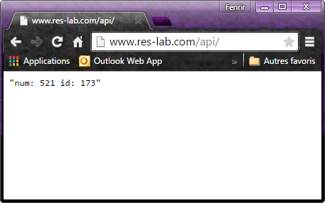

# RES: Web Infrastructure Lab (Documentation)

## Matériel utilisé

Pour faire notre infrastructure, nous avons utlisé un docker (http) contenant déjà apache avec un fichier de configuration bien rempli pour le reverse proxy et le load balancer. Pour le frontend, nous en utilisons un avec PHP, nous permettent ainsi d'avoir une page en PHP. Le backend est fait en node.js.

## Mise en place

La première étape pour pouvoir tester notre infrastructure, et d'ajouter la ligne suivante dans le fichiers **hosts** de votre machine afin de pouvoir visualiser le résultat dans votre navigateur web:

    192.168.42.42 www.res-lab.com #l'adresse IP correspond à celle de l'environnement vagrant

Ensuite, il faut faire un **vagrant ssh** pour pouvoir entrer dans l'environnement vagrant. 
Pour pouvoir lancé tout les containers, il y a des script bash qui lance toute l'infrastructure. 

Le premier à lancer est **build\_containers** qui va construire les différents containers et ensuite c'est **run\_containers** pour les lancés (Note: ils sont lancé en arrière plan). Il **stop_containers** qui permet d'arrêter tout les containers lancé avec le script précédent.

Actuellement, il n'y a que le reverse proxy qui marche, les scripts vont donc lancé trois containers : le serveur en reverse-proxy et 2 qui générent une page en html.

## Test du bon fonctionnement

Pour pouvoir observer si tout marche comme il faut, ouvrez une page internet avec votre navigateur à l'adresse **www.res-lab.com** et vous devriez observer ceci:

Et si vous rajouter **/api/** vous devriez voir ceci:

Auteurs: 

- Joao Miguel Domingues Pedrosa
- Toni Dias
- Nicolas Kobel
- Marc Pellet
- Bryan Perroud