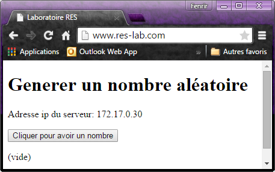

# RES: Web Infrastructure Lab (Documentation)

## Description de l'application
L'application permet simplement de genérer un nombre aléatoire. Et d'afficher l'adresse IP du serveur.

## Description de l'infrastructure
### frontend
Pour le frontend, nous avons simplement choisi d'implémenté un fichier index.php contenant du html et une requête ajax pour le rafraichissment dynamique du numéro aléatoire.
### backend
Le backend fait la generation aléatoire du nombre.
### proxy / loadbalancer
le proxy retranscrit le chemin demandé sur l'adresse ip et le port voulu.
le loadbalancer permet le dispachement des requetes sur plusieurs serveurs (qui à l'origine font la même chose). Cela permet d'éviter une surcharge des serveurs
### decouverte dynamique
Permet de gerer automatiquement les serveurs disponibles (backend / frontend) le tout est gerer par des heartbeat placé dans les backend et les frontend. Il se charge de voir quand un serveur disparaît ou apparaît. Dans le serveur proxy/loadbalancer se trouve la partie qui s'occupe de récupérer les datagrammes pour refaire la configuration du serveur et le relancer.

## Matériel utilisé

Pour faire notre infrastructure, nous avons utlisé un docker (http) contenant déjà apache avec un fichier de configuration bien rempli pour le reverse proxy et le load balancer. Pour le frontend, nous en utilisons un avec PHP, nous permettent ainsi d'avoir une page en PHP. Le backend, heartbeat et la découverte dynamique est fait en node.js.

Pour le partage d'informations et de fichier nous avons utilié Slack.

## Mise en place de l'infrastructure

La première étape pour pouvoir tester notre infrastructure, et d'ajouter la ligne suivante dans le fichiers **hosts** de votre machine afin de pouvoir visualiser le résultat dans votre navigateur web:

	192.168.42.42 www.res-lab.com 
    #l'adresse IP correspond à celle de l'environnement vagrant

Ensuite, il faut faire un **vagrant up** puis **vagrant ssh** pour pouvoir entrer dans l'environnement vagrant. 
Pour pouvoir lancer tous les containers, il y a des scripts bash qui lancent toute l'infrastructure. 

Le premier à lancer est **build\_images** construisant les différents containers. Puis **run_loadbalancer** pour lancer le loadbalancer.  Ensuite, on execute **run\_loadbalancer** pour lancer le serveur proxy. Pour pouvoir lancer un frontend, il faut faire cette commande
	
	docker run -it -d my-front
Et pour lancer un backend:
	
	docker run -it -d my-back	
Il y a **stop\_all_containers** qui permet d'arrêter tout les containers lancé précédement.
Les hearthbeats et la découverte dynamique se lance automatiquement des qu'un container est mis en marche.

## Test du bon fonctionnement

Pour pouvoir observer si tout marche comme il faut, ouvrez une page internet avec votre 
navigateur à l'adresse **www.res-lab.com** et vous devriez observer ceci:

Si vous appuyer sur le bouton, un nombre aléatoire devrais apparaitre à chaque nouvelle appuye.

##Auteurs: 

- Joao Miguel Domingues Pedrosa
- Toni Dias
- Nicolas Kobel
- Marc Pellet
- Bryan Perroud
